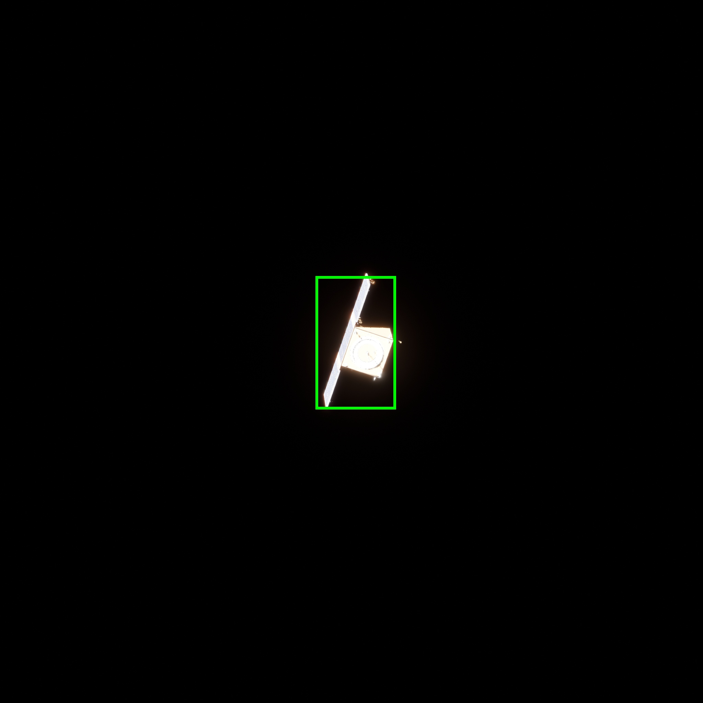

# PolarFire SoC YOLOv8 위성 객체 탐지

단일 클래스 위성 객체 탐지용으로 학습·pruning한 YOLOv8 모델을 VectorBlox V1000 VNNX로 변환하고, PolarFire SoC Icicle Kit에서 실행하기 위한 코드이다.

박사님이 제공한 원본 `run-model.cpp`와 공용 `postprocess.c`는 로컬 참고용으로만 보존한다. 이 저장소에는 커스텀 모델용 runner와 전용 후처리, 테스트 이미지·라벨·검출 결과 이미지만 올린다. VNNX와 SDK/보드 백업 압축파일, 교차컴파일된 실행 파일은 `.gitignore`로 제외한다.

## 현재 검증 상태

- VNNX graph version: `0xf1267b05` — 보드 SDK와 일치
- VNNX magic: `0x1abe11ed`
- accelerator preset: `V1000 (2)`
- `MODEL_SANITY = 0`
- 32 MiB 연속 DMA 영역 내 실행 성공
- JPEG 전처리 → V1000 추론 → INT8 DFL decode → NMS → 원본 좌표 복원 성공
- 정답 라벨 대비 최종 bbox IoU: 약 `0.823`
- annotated JPEG 저장 및 end-to-end 시간 측정 성공

사용한 1024 모델 정보:

| 항목 | 값 |
|---|---:|
| 파일명 | `best_60_1024.vnnx` |
| 파일 크기 | 10,114,384 bytes (9.65 MiB) |
| SHA-256 | `db466999280b927c757aef8f58cf33e36a70e6426d6175abadd28a156e7ec399` |
| 입력/출력 수 | 1 / 3 |
| 클래스 수 | 1 |
| DFL `reg_max` | 16 |

> `best_60_1024.vnnx`는 크기와 배포 정책 때문에 Git에 포함하지 않는다.

## 저장소 파일

| 파일 | 역할 |
|---|---|
| `soc-c/run_yolov8n.cpp` | 모델 로드, JPEG 전처리, DMA 관리, V1000 실행, 결과 저장 및 시간 측정 |
| `postprocess/postprocess_yolov8n.c` | INT8 역양자화, sigmoid, DFL decode, NMS, 좌표 복원 |
| `postprocess/postprocess_yolov8n.h` | 커스텀 후처리 인터페이스 및 tensor layout 정의 |
| `test.png` | 2048×2048 원본 검증 이미지 |
| `test.jpg` | 보드 JPEG loader용 변환 이미지 |
| `test.txt` | YOLO 형식 정답 라벨 |
| `annotated_output.jpg` | 보드 검출 결과 이미지 |

## 입출력 포맷

### 입력

VNNX 메타데이터가 보고하는 입력은 다음과 같다.

```text
shape      = [1, 1024, 3, 1024]
layout     = HCW (batch 포함 시 NHCW)
datatype   = UINT8
scale      = 1.0
zero point = 0
```

JPEG는 RGB interleaved로 읽은 뒤 채널별 resize를 거쳐 CHW로 만들고, 이 모델의 VNNX 입력에 맞게 HCW 순서로 재배열한다. `test.jpg`는 2048×2048이므로 1024×1024로 축소되며 letterbox는 필요하지 않다.

### 출력

각 출력은 `64 DFL channels + 1 class-logit channel = 65 channels`가 결합된 INT8 NCHW tensor이다.

| 출력 | Shape | Stride | Scale | Zero point |
|---|---|---:|---:|---:|
| output 0 | `[1,65,32,32]` | 32 | 0.127213 | 53 |
| output 1 | `[1,65,64,64]` | 16 | 0.121277 | 51 |
| output 2 | `[1,65,128,128]` | 8 | 0.172348 | 65 |

후처리는 class logit에 sigmoid를 적용하고, 4방향 각각 16-bin DFL softmax expectation을 계산한 뒤 class-agnostic NMS를 수행한다. 최종 출력 형식은 원본 이미지 좌표 기준의 다음 형식이다.

```text
object CONFIDENCE (x1, y1, x2, y2)
```

이 VNNX 변환 경로에서는 HCW 입력과 함께 공간축이 교환되어 나타났다. `test.txt` 정답 라벨과 비교해 확인한 후 최종 좌표 복원 단계에서 x/y를 교환한다.

## DMA 메모리

보드의 `/sys/class/u-dma-buf/udmabuf-ddr-nc0` 크기는 32 MiB이다.

| 항목 | 점유량 |
|---|---:|
| VNNX `ALLOCATE_BYTES` | 23.73 MiB |
| UINT8 입력 | 3.00 MiB |
| INT8 출력 3개 | 1.33 MiB |
| 예상 합계 | 28.07 MiB |
| 32 MiB 대비 여유 | 약 3.93 MiB |

`DMA_BYTES`는 동시에 점유하는 메모리가 아니라 추론 중 발생한 누적 DMA 전송량이므로 DMA pool 점유량과 직접 비교하지 않는다.

2048 입력으로 변환했던 이전 모델은 `ALLOCATE_BYTES = 109.04 MiB`여서 실행할 수 없었다. 입력을 1024로 낮추고 보드 SDK와 동일한 graph version으로 다시 변환해 현재 크기로 줄였다.

## WSL 교차 컴파일

VectorBlox SDK의 `example/soc-c`와 `example/postprocess`에 커스텀 소스를 복사한다.

```bash
cp /mnt/d/VectorBlox_Icicle_Code/soc-c/run_yolov8n.cpp \
  ~/vectorblox-build/VectorBlox-SDK/example/soc-c/

cp /mnt/d/VectorBlox_Icicle_Code/postprocess/postprocess_yolov8n.c \
  ~/vectorblox-build/VectorBlox-SDK/example/postprocess/

cp /mnt/d/VectorBlox_Icicle_Code/postprocess/postprocess_yolov8n.h \
  ~/vectorblox-build/VectorBlox-SDK/example/postprocess/
```

RISC-V용으로 빌드한다.

```bash
cd ~/vectorblox-build/VectorBlox-SDK/example/soc-c

touch run_yolov8n.cpp
touch ../postprocess/postprocess_yolov8n.c
touch ../postprocess/postprocess_yolov8n.h

make -f Makefile.yolov8n \
  kit=icicle \
  CC=riscv64-linux-gnu-gcc \
  CXX=riscv64-linux-gnu-g++

file run-yolov8n
```

생성물은 RISC-V 64-bit double-float ABI 실행 파일이어야 한다.

```text
ELF 64-bit LSB pie executable, UCB RISC-V, RVC, double-float ABI
```

## 보드 실행

명령 형식:

```text
run-yolov8n MODEL.vnnx IMAGE.jpg [CONFIDENCE] [NMS_IOU]
```

검증 명령:

```sh
cd /root

./run-yolov8n \
  /root/best_60_1024.vnnx \
  /root/test.jpg \
  0.30 0.40
```

## `test.jpg` 최종 검증 결과

```text
DATA_BYTES     = 10114384 (9.65 MiB)
ALLOCATE_BYTES = 24884864 (23.73 MiB)
MODEL_SANITY   = 0
input raw shape: [1,1024,3,1024]
input: HCW 3x1024x1024 scale=1 zero=0
DMA plan: model=23.73 MiB input=3.00 MiB outputs=1.33 MiB total=28.07 MiB
network took 196.468 ms
output[0] raw shape: [1,65,32,32]
output[0]: NCHW 1x32x32x65 scale=0.127213 zero=53
output[1] raw shape: [1,65,64,64]
output[1]: NCHW 1x64x64x65 scale=0.121277 zero=51
output[2] raw shape: [1,65,128,128]
output[2]: NCHW 1x128x128x65 scale=0.172348 zero=65
detections: 1
object 0.8394 (918.9, 804.1, 1153.1, 1192.5)
Saved annotated output to annotated_output.jpg
Timing summary: preprocess=1861.778 ms, model=196.468 ms, postprocess=1267.815 ms, total=3326.061 ms, fps(end-to-end)=0.301
```

결과 이미지:



## 정답 라벨 비교

`test.txt`는 YOLO 형식 `class cx cy width height`의 정규화 좌표이다.

```text
0 0.515381 0.484619 0.113770 0.193848
```

2048×2048 픽셀 좌표로 변환한 정답과 보드 결과는 다음과 같다.

| 항목 | `(x1, y1, x2, y2)` |
|---|---|
| 정답 | 약 `(939, 794, 1172, 1191)` |
| 축 보정 전 보드 결과 | `(804.1, 918.9, 1192.5, 1153.1)` |
| 축 보정 후 최종 결과 | `(918.9, 804.1, 1153.1, 1192.5)` |

- 축 보정 전 IoU: 약 `0.423`
- 축 보정 후 IoU: 약 `0.823`

이 비교를 통해 HCW 입력 모델의 공간축 복원이 필요함을 확인했다.

## 성능 해석

- 순수 V1000 추론: `196.468 ms`, 약 `5.09 FPS`
- JPEG 파일 입력부터 annotated JPEG 저장까지: `3326.061 ms`, 약 `0.301 FPS`

end-to-end 측정에는 2048×2048 JPEG 디코딩, CPU resize, CHW→HCW 재배열, DFL/NMS, 박스 그리기 및 JPEG 재인코딩이 모두 포함된다. 따라서 `0.301 FPS`는 파일 입출력 검증 경로의 성능이며, 카메라 frame buffer를 직접 사용하는 실시간 파이프라인 성능과 동일하지 않다.

## 참고: 박사님 원본과의 차이

박사님 모델과 커스텀 모델은 학습 데이터와 출력 구조가 다르므로 검출 정확도를 직접 비교하지 않는다.

| 항목 | 박사님 원본 모델 | 커스텀 모델 |
|---|---:|---:|
| 입력 | 640×640 NCHW | 1024×1024 HCW |
| 출력 | 6개: DFL 64와 class 1 분리 | 3개: 65채널 결합 |
| 순수 추론 | 약 120.53 ms / 8.30 FPS | 약 196.47 ms / 5.09 FPS |

박사님 원본 파일은 구현 참고용으로만 로컬에 유지하며 Git에는 올리지 않는다.
